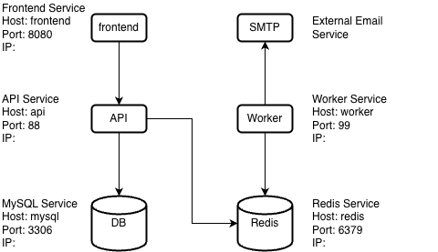

# EventBuzz
EventBuzz is School Events & Notification Center platform, developed as part of the AIBEST Tech Academy in 2026.

## Documents
Platofrm requirements are documented - [here](docs/school-events-notification-center.md)  
Grading requirements are documented - [here](docs/school-events-grading-criteria.md)

## Infrastructure and Services
### High-level design



### Server Login

```bash
ssh master@20.240.203.38
```

### Services

Portainer

phpMyAdmin

RedisInsight

WG Admin


