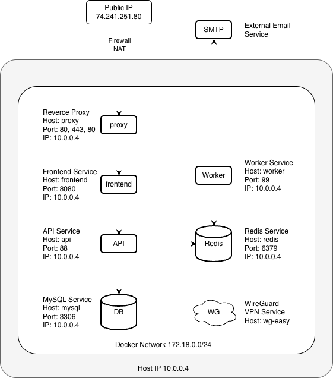

# HARP
HARP stand for "Hub for Academic Resources and Planning".  
HARP is School Events & Notification Center platform, developed as part of the AIBEST Tech Academy in 2026.

## Documents
Platofrm requirements are documented - [here](docs/school-events-notification-center.md)  
Grading requirements are documented - [here](docs/school-events-grading-criteria.md)

## Infrastructure and Design
### High-level design



### Server Login

```bash
ssh master@74.241.251.80
```

## Services

### Portainer
Access the GUI via https://10.0.0.4:9443/  
U: master  
P: MkCeYNx59Cmb#SyWYh!8

### phpMyAdmin
Access the GUI via http://10.0.0.4:8306/  
No username / pass

### RedisInsight
Access the GUI via http://10.0.0.4:5540/  
No username / pass

### WG Admin
Access the GUI via http://10.0.0.4:51821/  
No username / pass

### Nginx Proxy Manager
Access the GUI via http://10.0.0.4:81/  
U: dgkovachev@gmail.com  
P: tjAuO7#&vZv4^v#TWpf*

### Webmin
Access the GUI via https://10.0.0.4:10000/  
U: master  
P: MkCeYNx59Cmb#SyWYh!8

## Public URLs

- https://harp.smartech.bg/ (frontend)
- https://harpapi.smartech.bg/ (backend)

## Connections

### Local development
WireGuard is required!

MySQL Server:
- Host: 10.0.0.4
- Port: 3306
- Database: harp
- User: harp
- Pass: Zjf0!zqhQunFsfKK7U5r

Redis Server:
- Host: 10.0.0.4
- Port: 6379

### Production

MySQL Server:
- Host: mysql
- Port: 3306
- Database: harp
- User: harp
- Pass: Zjf0!zqhQunFsfKK7U5r

Redis Server:
- Host: redis
- Port: 6379

### SMTP Server
- User: harp@smartech.bg
- Pass: MOUsHarfeM,90,{
- Server: mail.smartech.bg
- Port: 587 (STARTTLS)
- Port: 465 (TLS)
